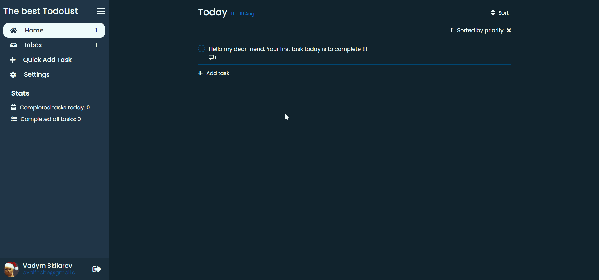
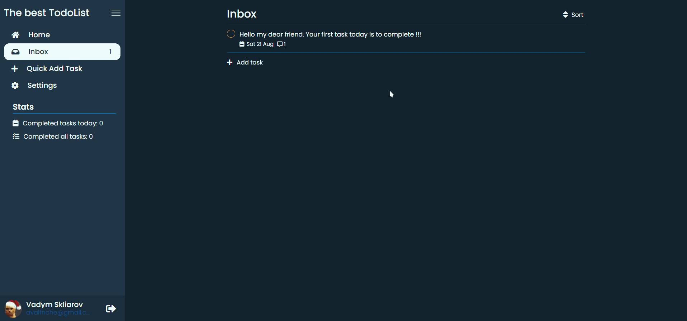

# The best TodoList

An application use Firebase for hosting and datebase, built with React, JavaScript, and SCSS.

## Project Status

This project is currently developing. Users can sing up and sing in with Google or email and passwod, can mix them, change theme and language, turn on and of vibration and sound, name, password, avatar, add, delete or edit tasks with date, priority and comments, sort tasks. For mobile added swipe sidebar, vibration and sound.

## Project Screen Shots

## Installation and Setup Instructions

Open [https://todol-dev.firebaseapp.com/](https://todol-dev.firebaseapp.com/) to view it in the browser.

Clone down this repository. You will need firebase account and `node`, `npm` installed globally on your machine.

Installation:

Clone repository

`git clone https://github.com/Avalanche322/TodoList.git`  

Open folder

`cd TodoList`

Install node modules:

`npm install`

To create `.env.local` (API Google Firebase)

You must open your IDE and create `.env.local` in root folder.

REACT_APP_API_KEY= API KEY  
REACT_APP_AUTH_DOMAIN= AUTH DOMAIN  
REACT_APP_PROJECT_ID= PROJECT ID  
REACT_APP_STORAGE_BUCKET= STORAGE BUCKET  
REACT_APP_MESSAGING_SENDER_ID= MESSAGING SENDER ID  
REACT_APP_APP_ID= APP ID  
REACT_APP_MEASUREMENT_ID= MEASUREMENT ID  

To Start Server:

`npm run start`  

To Visit App:

`http://localhost:3000` 
